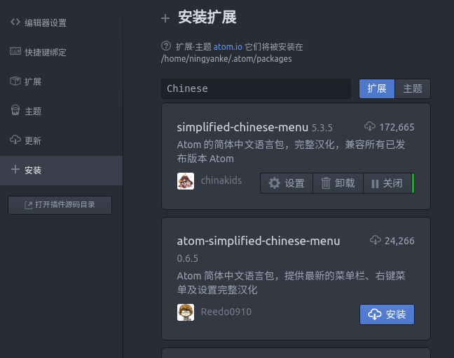
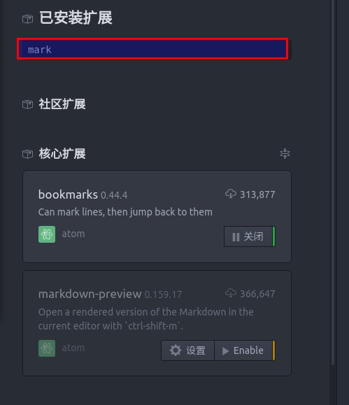
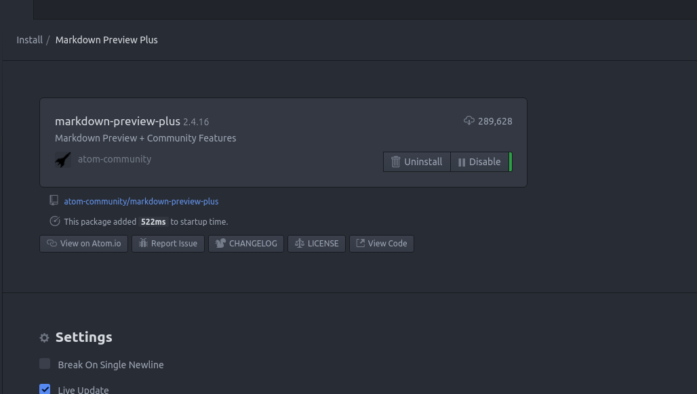
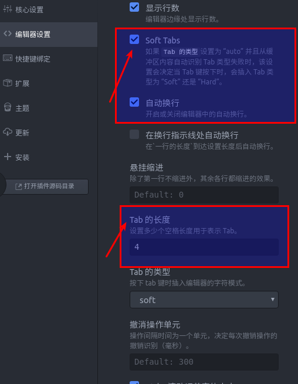
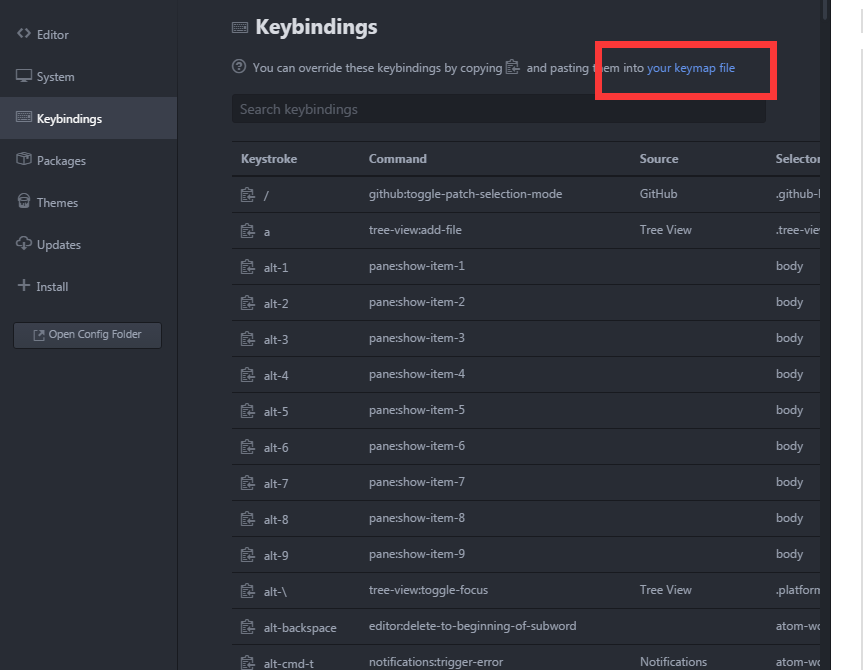
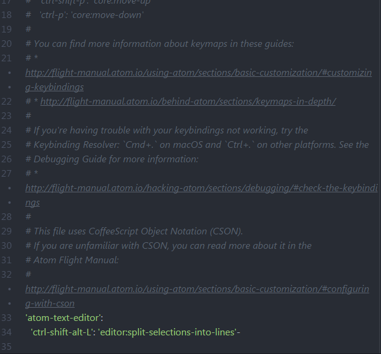

### Atom编辑器

#### 1.下载
>[官方网站](https://atom.io/)可自动生成自己系统对应版本的编辑器软件,然后点击下载

#### 2.安装
>我使用的是Ubuntu系统,直接使用软件中心安装，或者在命令行中输入
>`dkpg -i xxxx.deb`

#### 3.配置
>3.1配置中文语言
>选取`install`,输入`Chinese`选取最高的插件安装
>
>
>3.2安装`markdown`支持包
>
>1)`markdown-preview-plus`
>Atom自带的`Markdown`预览插件`markdown-preview`功能比较简,`markdown-preview-plus`对其做了功能扩展和增强。
>>* 支持预览实时渲染(`Ctrl + Shift + M`)
>>* 支持`Latex公式`(`Ctrl + Shift + X`)

>使用该插件前,需要先禁用`markdown-preview`.点击`disable`禁用
>
>
>`Enable`新插件
>
>
>2)`markdown-scroll-sync`同步滚屏
>
>同步滚动是`Markdown`编辑器的必备功能,方便翻阅文档修改时能快速定位到预览的位置.
>markdown-scroll-sync不仅支持同步滚动,在光标位置发生变更时也会同步滚动，这个功能在很多Markdown编辑器中不具备.
>同样在`install`中搜索安装
>
>3）`language-markdown`
>一般的Markdown编辑器提供了代码着色等基本功能`language-markdown`除了能给代码着色，还提供了快捷的代码片段生成等功能
>
>4）`markdown-image-paste`
>图片功能支持的好坏直接决定了我是否选择使用一个`Markdown`编辑器.也有不少编辑器和在线的图床绑定,但是这种方式受限于网络.虽然`Markdown`支持插入本地图片,但是每次插入新图片都是一堆重复操作：截图－命名－保存－插入.`markdown-image-paste`将这些操作一步完成：

>>* 使用截图工具将图片复制到系统剪切板。
>>* 在Markdown新起一行输入文件名。
>>* `Ctrl + V`会自动把图片保存到Markdown文件相同目录下(因此要求Markdown文件应该先保存)，并命名为刚输入的文件名，同时在刚才输入文件名行处生成`img`标签。

>5)`markdown-table-editor`
>表格编辑,具有强大的功能

>6)`markdown-preview-opener`
> 这个控件可以让打开的`.md`文件默认显示预览视图

>3.3设置文本缩进
>
>

>3.4 配置自己快捷键
>
> 主要是为了编写文档的时候复制粘贴很多行，又有缩进的情况
> 点击 `flie`-`setting`找到如图所示选项，编辑下图所示的代码

>

>

>3.5快捷键参考

>## 文件切换
>`ctrl-shift-s`  保存所有打开的文件  
>`cmd-shift-o`  打开目录  
>`cmd-\`   显示或隐藏目录树  
>`ctrl-0`   焦点移到目录树  
>目录树下，使用a，m，delete来增加，修改和删除  
>`cmd-t`或`cmd-p` 查找文件  
>`cmd-b` 在打开的文件之间切换  
>`cmd-shift-b` 只搜索从上次git commit后修改或者新增的文件  >

>## 导航  
>（等价于上下左右）  
>`ctrl-p` 前一行  
>`ctrl-n` 后一行  
>`ctrl-f` 前一个字符  
>`ctrl-b` 后一个字符  >

>`alt-B`, `alt-left` 移动到单词开始  
>`alt-F`, `alt-right` 移动到单词末尾  >

>`cmd-right`, `ctrl-E` 移动到一行结束  
>`cmd-left`, `ctrl-A`  移动到一行开始  >

>`cmd-up` 移动到文件开始  
>`cmd-down` 移动到文件结束  >

>`ctrl-g` 移动到指定行 row:column 处>

>`cmd-r` 在方法之间跳转>

>## 目录树操作  
>`cmd-\` 或者 `cmd-k cmd-b` 显示(隐藏)目录树  
>`ctrl-0` 焦点切换到目录树(再按一次或者`Esc`退出目录树)  
>`a` 添加文件  
>`d` 将当前文件另存为(duplicate)  
>`i` 显示(隐藏)版本控制忽略的文件  
>`alt-right` 和 `alt-left` 展开(隐藏)所有目录  
>`ctrl-al-]` 和 `ctrl-al-[` 同上  
>`ctrl-[` 和 `ctrl-]` 展开(隐藏)当前目录  
>`ctrl-f` 和 `ctrl-b` 同上  
>`cmd-k h` 或者 `cmd-k left` 在左半视图中打开文件  
>`cmd-k j` 或者 `cmd-k down` 在下半视图中打开文件  
>`cmd-k k` 或者 `cmd-k up` 在上半视图中打开文件  
>`cmd-k l` 或者 `cmd-k right` 在右半视图中打开文件  
>`ctrl-shift-C` 复制当前文件绝对路径>
>

>## 书签
>`cmd-F2` 在本行增加书签  
>`F2` 跳到当前文件的下一条书签  
>`shift-F2` 跳到当前文件的上一条书签  
>`ctrl-F2` 列出当前工程所有书签  >

>## 选取
>> 大部分和导航一致，只不过加上shift  >

>`ctrl-shift-P`  选取至上一行  
>`ctrl-shift-N`  选取至下一样  
>`ctrl-shift-B`  选取至前一个字符  
>`ctrl-shift-F`  选取至后一个字符  
>`alt-shift-B`, `alt-shift-left`  选取至字符开始  
>`alt-shift-F`, `alt-shift-right`  选取至字符结束  
>`ctrl-shift-E`, `cmd-shift-right`  选取至本行结束  
>`ctrl-shift-A`, `cmd-shift-left`  选取至本行开始  
>`cmd-shift-up`  选取至文件开始  
>`cmd-shift-down`  选取至文件结尾  
>`cmd-A`  全选  
>`cmd-L`  选取一行，继续按回选取下一行  
>`ctrl-shift-W`  选取当前单词  >

>## 编辑和删除文本
>### 基本操作
>`ctrl-T` 使光标前后字符交换  
>`cmd-J` 将下一行与当前行合并  
>`ctrl-cmd-up`, `ctrl-cmd-down` 使当前行向上或者向下移动  
>`cmd-shift-D` 复制当前行到下一行  
>`cmd-K`, `cmd-U` 使当前字符大写  
>`cmd-K`, `cmd-L` 使当前字符小写  
>`cmd-shift-P` 搜索命令  >

>### 删除和剪切
>`ctrl-shift-K` 删除当前行  
>`cmd-backspace` 删除到当前行开始  
>`cmd-fn-backspace` 删除到当前行结束  
>`ctrl-K` 剪切到当前行结束  
>`alt-backspace` 或 `alt-H` 删除到当前单词开始  
>`alt-delete` 或 `alt-D` 删除到当前单词结束  >

>### 多光标和多处选取  
>`cmd-click` 增加新光标  
>`cmd-shift-L` 将多行选取改为多行光标  
>`ctrl-shift-up`, `ctrl-shift-down` 增加上（下）一行光标  
>`cmd-D` 选取文档中和当前单词相同的下一处  
>`ctrl-cmd-G` 选取文档中所有和当前光标单词相同的位置  >

>### 括号跳转  
>`ctrl-m` 相应括号之间，html tag之间等跳转  
>`ctrl-cmd-m` 括号(tag)之间文本选取  
>`alt-cmd-.` 关闭当前XML/HTML tag  >

>### 编码方式  
>`ctrl-shift-U` 调出切换编码选项  >

>## 查找和替换  
>`cmd-F` 在buffer中查找  
>`cmd-shift-f` 在整个工程中查找  >

>## 代码片段  
>`alt-shift-S` 查看当前可用代码片段  
>> 在`~/.atom`目录下`snippets.cson`文件中存放了你定制的snippets  >

>[定制说明](https://atom.io/docs/v1.0.0/using-atom-snippets)  >

>## 自动补全  
>`ctrl-space` 提示补全信息  >

>## 折叠  
>`alt-cmd-[` 折叠  
>`alt-cmd-]` 展开  
>`alt-cmd-shift-{` 折叠全部  
>`alt-cmd-shift-}` 展开全部  
>`cmd-k cmd-N` 指定折叠层级 N为层级数  >

>## 文件语法高亮  
>`ctrl-shift-L` 选择文本类型  >

>## 使用Atom进行写作  
>`ctrl-shift-M` Markdown预览  
>可用代码片段
>> b, legal, img, l, i, code, t, table>

>## git操作
>`cmd-alt-Z` checkout HEAD 版本  
>`cmd-shift-B` 弹出untracked 和 modified文件列表  
>`alt-g down` `alt-g up` 在修改处跳转  
>`alt-G D` 弹出diff列表  
>`alt-G O` 在github上打开文件  
>`alt-G G` 在github上打开项目地址  
>`alt-G B` 在github上打开文件blame  
>`alt-G H` 在github上打开文件history  
>`alt-G I` 在github上打开issues  
>`alt-G R` 在github打开分支比较  
>`alt-G C` 拷贝当前文件在gihub上的网址  

[文章出处](http://www.cnblogs.com/fanzhidongyzby/p/6637084.html)
