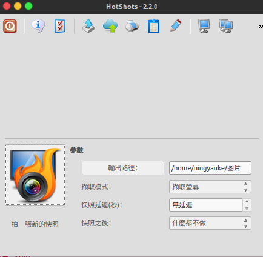
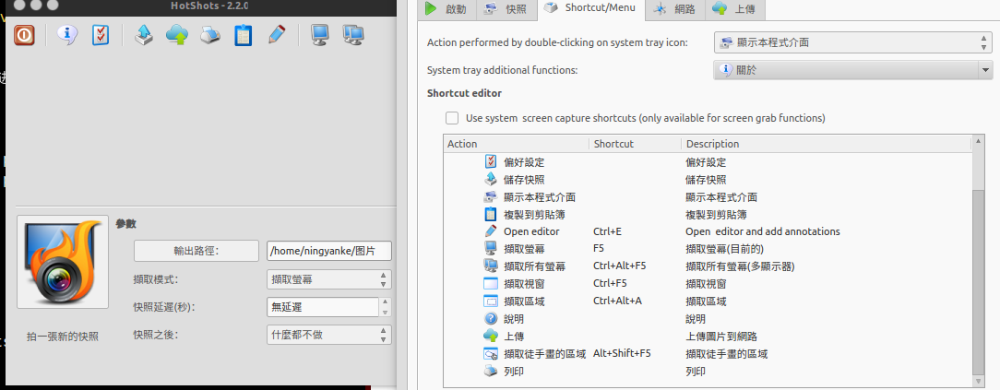

### Ubuntu截图工具
#### 两种好用的Ubuntu工具
#### 1.使用deepin截图工具
>[项目主页](https://github.com/linuxdeepin/deepin-screenshot)

#### 2.使用HotShots
>[项目主页](http://www.edivaldobrito.com.br/captura-de-tela-no-linux-hotshots/)

>安装可以完全按照主页上的说明进行安装

>1.加载安装源
>```bash
>sudo add-apt-repository ppa:ubuntuhandbook1/apps
>sudo add-apt-repository ppa:dhor/myway
>```
>2.更新
>```bash
>sudo apt-get update
>```
>3.安装
>```bash
>sudo apt-get install hotshots``
>```
>4.移除
>```bash
>sudo apt-get install hotshots
>```
>
>软件截图
>
>
>
>设置如qq截图的快捷键
> 
>
